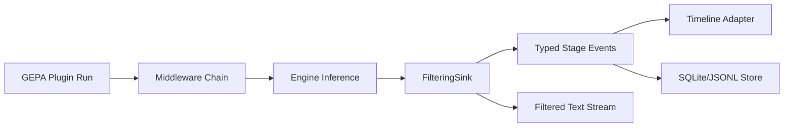
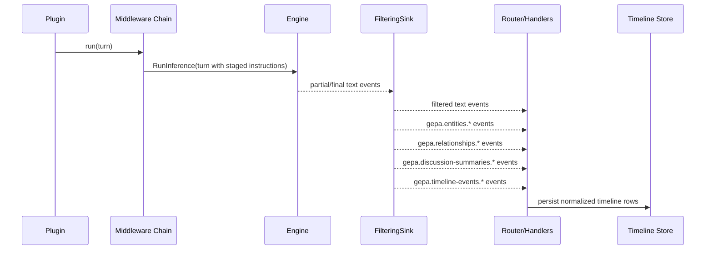

# Structured Middleware Extraction Playbook (Entities, Relationships, Summaries, Timeline Events)

## Executive Summary

This document proposes a production-ready design for a progressive structured-extraction pipeline in GEPA using geppetto middleware and structured sinks. The target behavior is a staged extraction chain:

1. Stage A: identify entities from the running dialog/transcript.
2. Stage B: infer relationships among those entities.
3. Stage C: append discussion summaries as the conversation evolves.
4. Stage D: emit timeline events that can be rendered directly in timeline UIs.

The core architectural decision is to keep responsibilities separated:

- middleware is used for prompt composition, execution orchestration, and post-run state wiring,
- `structuredsink.FilteringSink` is used to parse tagged structured blocks and emit typed events,
- event handlers persist/route those typed events for downstream timeline construction.

This aligns with existing geppetto contracts:

- middleware composition around inference (`middleware.Middleware`, `middleware.Chain`) in `geppetto/pkg/inference/middleware/middleware.go:8-23`,
- middleware attachment through enginebuilder in `geppetto/pkg/inference/toolloop/enginebuilder/options.go:31-35` and `.../builder.go:140-151`,
- streaming extraction and typed event emission via `structuredsink.FilteringSink` in `geppetto/pkg/events/structuredsink/filtering_sink.go:48-61` and `:324-452`.

The result is a robust, intern-friendly implementation model that avoids monolithic prompt builders and avoids brittle post-hoc regex parsing.

## Audience, Scope, and Learning Goals

### Audience

This playbook is written for:

- new interns joining GEPA/geppetto,
- engineers adding extraction features to dataset generation or candidate-run pipelines,
- maintainers hardening event semantics for timeline-oriented products.

### Scope

In scope:

- design of staged extraction (entities -> relationships -> summaries -> timeline),
- middleware + filtering sink integration patterns,
- event schema contracts and correlation metadata,
- implementation and test plan,
- operational guidance and failure handling.

Out of scope:

- UI component implementation details in timeline frontends,
- model-specific benchmark comparisons,
- replacing existing GEPA optimization loops.

### Learning goals for a new intern

After reading this playbook, an intern should be able to:

- explain where middleware lives in the runtime call path,
- explain where structured sink parsing lives,
- implement one extractor end-to-end,
- add tests for malformed/partial stream behavior,
- trace an emitted event from model output to timeline-ready JSON.

## Problem Statement

The current GEPA plugin workflows are strong at optimization and dataset generation, but they do not yet provide a first-class progressive extraction pipeline for timeline semantics.

Evidence in current code:

- dataset generation scripts can already ask models for rich structured JSON (`exp-11`) but do extraction in a single payload parse (`.../exp-11-coaching-dataset-generator.js:101-156`, `:236-247`, `:261-298`),
- plugins commonly run single prompt/response cycles via `runUserPrompt` (`go-go-gepa/cmd/gepa-runner/scripts/lib/gepa_optimizer_common.js:49-60`),
- middleware and event sink primitives are present and composable (`geppetto/pkg/inference/middleware/middleware.go:8-23`, `geppetto/pkg/events/context.go:16-27`),
- structured sink already solves streamed tagged extraction and typed event fan-out (`geppetto/pkg/events/structuredsink/filtering_sink.go:167-177`, `:324-452`).

Gap:

- no unified staged extraction contract that captures entities, relationships, summaries, and timeline events in one coherent chain,
- no canonical schema vocabulary shared across these stages,
- no standard guidance for storing progressive extraction outputs as timeline-ready event envelopes.

## Current-State Architecture Mapping

### 1) GEPA plugin runtime and contracts

Plugin descriptor validation and module exposure:

- JS module `gepa/plugins` defines strict plugin descriptor contracts for optimizer and dataset-generator plugins in `go-go-gepa/cmd/gepa-runner/gepa_plugins_module.go:30-131`.
- Optimizer loader validates descriptor shape and loads optional callables (`evaluate`, `run`, `merge`, `selectComponents`, etc.) in `go-go-gepa/cmd/gepa-runner/plugin_loader.go:82-133`.
- Dataset generator loader enforces `generateOne` and normalizes row/metadata output in `go-go-gepa/pkg/dataset/generator/plugin_loader.go:105-149` and `:190-219`.

Runtime creation:

- GEPA runner creates goja runtime, registers geppetto JS module, and enables `gepa/plugins` in `go-go-gepa/cmd/gepa-runner/js_runtime.go:31-57`.

Candidate and dataset commands:

- dataset generate command uses `datasetgen.RunWithRuntime` and passes profile/engine options in `go-go-gepa/cmd/gepa-runner/dataset_generate_command.go:111-126`.
- candidate run command uses plugin `run()` and records optional run rows in SQLite in `.../candidate_run_command.go:258-320` and `.../candidate_run_store.go:32-91`.

### 2) GEPA sample plugin behavior

Common helper:

- `runUserPrompt` constructs a session and runs one user prompt in `go-go-gepa/cmd/gepa-runner/scripts/lib/gepa_optimizer_common.js:49-60`.

Representative plugins:

- `multi_param_math_optimizer` already demonstrates component-level feedback/trace maps, which is structurally similar to stage-wise extraction outputs (`.../multi_param_math_optimizer.js:56-94`),
- `optimize_anything_style_optimizer` demonstrates per-component contracts and round-robin component selection (`.../optimize_anything_style_optimizer.js:11-31`, `:98-113`),
- `toy_math_optimizer` shows minimal `dataset/evaluate/selectComponents/merge` loop (`.../toy_math_optimizer.js:20-79`).

### 3) `exp-11` coaching dataset generator insights

`exp-11` is the strongest current precedent for structured coaching data generation:

- dynamic prompt templating and fallback schema target in `.../exp-11-coaching-dataset-generator.js:225-250`,
- continuation-aware JSON assembly with stop-reason detection and overlap deduping in `:50-99` and `:118-156`,
- strict output checks for transcript and `ground_truth` in `:261-272`,
- metadata output already includes attempts/stop-reason context in `:286-297`.

This confirms the domain need: coaching trajectories already naturally contain entities, evolving relationships, and timeline structure. The missing piece is progressive extraction infrastructure rather than domain data availability.

### 4) geppetto middleware and sink primitives

Middleware core:

- middleware type and ordering are stable in `geppetto/pkg/inference/middleware/middleware.go:10-23`.
- builder wiring applies middlewares in order in `geppetto/pkg/inference/toolloop/enginebuilder/builder.go:86-88`, `:140-151`.

Existing middleware examples:

- system prompt mutation middleware (`.../systemprompt_middleware.go:11-95`),
- tool result reorder middleware (`.../reorder_tool_results_middleware.go:10-139`),
- logging middleware (`.../logging_middleware.go:11-87`).

Structured sink core:

- extractor interfaces in `geppetto/pkg/events/structuredsink/filtering_sink.go:48-61`,
- per-stream parser state and close-tag safe lag buffer in `:117-156`,
- typed event publish + filtered text forwarding in `:261-287`,
- malformed handling policies in `:454-486`.

Test coverage confirms robust behavior for split tags, malformed inputs, multiple streams, metadata propagation, and context cancellation in `geppetto/pkg/events/structuredsink/filtering_sink_test.go:138-190`, `:517-620`, `:622-720`, `:753-810`.

### 5) JS API bridge for middleware/session composition

JS API supports both Go and JS middlewares:

- `middlewares.fromJS` and `middlewares.go` refs in `geppetto/pkg/js/modules/geppetto/api_middlewares.go:15-53`,
- middleware resolution and context payload propagation in `:55-160`,
- builder methods (`useMiddleware`, `useGoMiddleware`, `withEventSink`) in `geppetto/pkg/js/modules/geppetto/api_sessions.go:98-186`,
- TypeScript API contracts for middleware, session, and stream events in `.../spec/geppetto.d.ts.tmpl:257-370`.

This is sufficient to deliver the staged extraction chain either from Go runtime wiring or from JS scripts.

## Gap Analysis Against Requested Outcome

Requested outcome:

- middleware sequence that first asks for entities, then relationships, then summaries,
- structured format capable of later timeline extraction,
- in-depth guidance and intern onboarding quality.

Current strengths:

- all low-level primitives already exist (middleware chain, event sinks, structured extraction, JS API bridge).

Current gaps:

1. No canonical multi-stage schema and envelope contract.
2. No explicit stage taxonomy/event naming conventions for timeline ingestion.
3. No documented orchestration strategy to combine middleware prompting with structuredsink parsing across stages.
4. No canonical persistence plan for stage outputs in GEPA run stores.

## Design Principles and Non-Negotiable Invariants

### Principle 1: Separate prompt orchestration from parsing

- middleware injects instructions and run context,
- sink/extractor parses and emits events,
- timeline adapters consume typed events.

### Principle 2: No hidden CoT harvesting

Use “structured reasoning artifacts” rather than unrestricted hidden chain-of-thought dumping.

Ask for:

- explicit entities,
- explicit relationships,
- explicit summaries,
- explicit timeline events.

Do not ask for unconstrained private reasoning text.

### Principle 3: Stable correlation IDs everywhere

Each emitted event must carry:

- `sessionId`, `inferenceId`, `turnId`,
- stream-scoped message ID and sequence number when relevant.

This aligns with event metadata pathways (`geppetto/pkg/events/chat-events.go:99-133`, JS collector payload fields in `geppetto/pkg/js/modules/geppetto/api_events.go:84-100`).

### Principle 4: Progressive + idempotent updates

Each stage should support partial updates and finalization events; downstream timeline assembly must be able to dedupe by `(event_type, stage_item_id, revision)`.

## Proposed Architecture

## 1) High-level component architecture



Interpretation:

- `B` injects stage instructions and stage context,
- `D` extracts tagged structured payloads,
- `E` includes entities/relationships/summaries/timeline events,
- `F` converts event stream to timeline UI entities,
- `G` stores normalized stage outputs for offline analysis and replay.

## 2) Stage model

We define stage ordering:

1. `entities`
2. `relationships`
3. `discussion_summaries`
4. `timeline_events`

Each stage emits two kinds of event:

- `stage.partial` (optional, progressive snapshots),
- `stage.completed` (required, final normalized payload).

Recommended event type names:

- `gepa.entities.partial`, `gepa.entities.completed`
- `gepa.relationships.partial`, `gepa.relationships.completed`
- `gepa.discussion-summaries.partial`, `gepa.discussion-summaries.completed`
- `gepa.timeline-events.partial`, `gepa.timeline-events.completed`

## 3) Structured tag strategy

Use structuredsink tag triples (`<package:type:version>`) per stage, matching extractor registration contract in `geppetto/pkg/events/structuredsink/filtering_sink.go:48-54`.

Recommended tags:

- `<gepa:entities:v1>`
- `<gepa:relationships:v1>`
- `<gepa:discussion_summaries:v1>`
- `<gepa:timeline_events:v1>`

## 4) Prompt orchestration strategy

Use middleware to ensure stage prompts are deterministic and ordered. Each middleware writes stage context into Turn metadata/blocks, then calls `next`.

Pseudo-order:

1. base system prompt middleware,
2. entities instruction middleware,
3. relationships instruction middleware (references extracted entities schema),
4. summaries instruction middleware,
5. timeline-events instruction middleware,
6. optional logging/tracing middleware.

Ordering rationale follows middleware execution semantics (`Chain(m1,m2,m3) -> m1(m2(m3(handler)))`) in `geppetto/pkg/inference/middleware/middleware.go:13-23` and docs `geppetto/pkg/doc/topics/09-middlewares.md:319-320`.

## 5) Event and storage architecture

All stage events are published via context sinks (`geppetto/pkg/events/context.go:16-27`, `:39-51`).

Use a two-path consumer model:

- live path: router handlers update timeline state/UI,
- durable path: append stage events into JSONL and/or SQLite for replay and analytics.

## Stage Data Contracts

## 1) Canonical envelope

Every stage event payload should be wrapped in a stable envelope:

```json
{
  "event_type": "gepa.entities.completed",
  "schema_version": "v1",
  "correlation": {
    "session_id": "...",
    "inference_id": "...",
    "turn_id": "...",
    "message_id": "...",
    "stage_item_id": "message:seq"
  },
  "stage": {
    "name": "entities",
    "ordinal": 1,
    "revision": 3,
    "is_final": true
  },
  "payload": {},
  "emitted_at_ms": 0
}
```

## 2) Entities schema

```json
{
  "entities": [
    {
      "entity_id": "E001",
      "name": "Alex",
      "entity_type": "person",
      "aliases": ["A."],
      "attributes": {
        "sentiment_state": "anxious",
        "role": "client"
      },
      "evidence": [
        {"session_id": "S01", "turn_index": 4, "quote": "..."}
      ]
    }
  ]
}
```

## 3) Relationships schema

```json
{
  "relationships": [
    {
      "relationship_id": "R004",
      "source_entity_id": "E001",
      "target_entity_id": "E003",
      "relationship_type": "trust_conflict",
      "polarity": -0.6,
      "confidence": 0.82,
      "evidence": [
        {"session_id": "S03", "turn_index": 11, "quote": "..."}
      ]
    }
  ]
}
```

## 4) Discussion summaries schema

```json
{
  "summaries": [
    {
      "summary_id": "DS02",
      "session_id": "S03",
      "time_window": {"from": "2025-01-10", "to": "2025-01-24"},
      "key_points": ["...", "..."],
      "open_questions": ["..."],
      "emotional_shift": "guarded -> hopeful"
    }
  ]
}
```

## 5) Timeline event schema

```json
{
  "timeline_events": [
    {
      "timeline_event_id": "T012",
      "timestamp_hint": "2025-01-24",
      "event_kind": "relationship_shift",
      "title": "Client re-engages with sibling",
      "description": "...",
      "actors": ["E001", "E003"],
      "derived_from": {
        "entity_ids": ["E001", "E003"],
        "relationship_ids": ["R004"],
        "summary_ids": ["DS02"]
      },
      "confidence": 0.77
    }
  ]
}
```

## Middleware and Extractor API Design

## 1) Go stage extractor interfaces

A pragmatic API that extends existing extractor patterns:

```go
// Existing extractor interfaces remain unchanged (FilteringSink compatible).
type StageName string

const (
    StageEntities StageName = "entities"
    StageRelationships StageName = "relationships"
    StageDiscussionSummaries StageName = "discussion_summaries"
    StageTimelineEvents StageName = "timeline_events"
)

type StageEnvelope struct {
    EventType    string         `json:"event_type"`
    SchemaVersion string        `json:"schema_version"`
    Correlation  map[string]any `json:"correlation"`
    Stage        map[string]any `json:"stage"`
    Payload      any            `json:"payload"`
    EmittedAtMS  int64          `json:"emitted_at_ms"`
}
```

## 2) Middleware factory for staged prompting

```go
func NewProgressiveExtractionMiddleware(cfg ProgressiveExtractionConfig) middleware.Middleware {
    return func(next middleware.HandlerFunc) middleware.HandlerFunc {
        return func(ctx context.Context, t *turns.Turn) (*turns.Turn, error) {
            // 1) Ensure stage instruction blocks exist in deterministic order.
            // 2) Optionally include prior stage snapshots as bounded context.
            // 3) Set metadata keys for correlation and config fingerprint.
            return next(ctx, t)
        }
    }
}
```

## 3) JS-side builder wiring example

Based on existing API (`useGoMiddleware`, `useMiddleware`, `withEventSink`) in `geppetto/pkg/js/modules/geppetto/api_sessions.go:98-186`:

```javascript
const gp = require("geppetto");

const session = gp
  .createBuilder()
  .withEngine(engine)
  .useGoMiddleware("systemPrompt", { prompt: BASE_PROMPT })
  .useMiddleware(gp.middlewares.fromJS(progressiveExtractionMw, "gepa-progressive"))
  .withEventSink(structuredFilteringSink)
  .buildSession();
```

## End-to-End Flow



## Reference Pseudocode

## 1) Runtime wiring (Go)

```go
router, _ := events.NewEventRouter()
downstream := middleware.NewWatermillSink(router.Publisher, "chat")

sink := structuredsink.NewFilteringSink(
    downstream,
    structuredsink.Options{Malformed: structuredsink.MalformedErrorEvents},
    &EntitiesExtractor{},
    &RelationshipsExtractor{},
    &DiscussionSummariesExtractor{},
    &TimelineEventsExtractor{},
)

engBuilder := enginebuilder.New(
    enginebuilder.WithBase(baseEngine),
    enginebuilder.WithMiddlewares(
        middleware.NewSystemPromptMiddleware(basePrompt),
        NewProgressiveExtractionMiddleware(cfg),
    ),
    enginebuilder.WithEventSinks(sink),
)
```

## 2) Stage aggregation handler

```go
func HandleStageEvent(ev events.Event, agg *StageAggregator) error {
    // Decode typed event.
    env := decodeStageEnvelope(ev)

    // Idempotence guard.
    key := fmt.Sprintf("%s:%s:%d", env.EventType, env.Correlation["stage_item_id"], env.Stage["revision"])
    if agg.Seen(key) {
        return nil
    }

    // Merge by stage.
    switch env.Stage["name"] {
    case "entities":
        agg.MergeEntities(env.Payload)
    case "relationships":
        agg.MergeRelationships(env.Payload)
    case "discussion_summaries":
        agg.MergeSummaries(env.Payload)
    case "timeline_events":
        agg.MergeTimeline(env.Payload)
    }

    // Persist snapshot / append delta.
    return agg.Persist(env)
}
```

## 3) Prompt-template strategy for stage discipline

```text
System: You are an extraction engine.
Rules:
1) Emit exactly one tagged block per stage when asked.
2) Use strict JSON/YAML payloads only.
3) Never include freeform commentary inside tagged blocks.

Stage entities:
<gepa:entities:v1>
```yaml
entities: ...
```
</gepa:entities:v1>

Stage relationships:
<gepa:relationships:v1>
```yaml
relationships: ...
```
</gepa:relationships:v1>
...
```

## Experiment Findings (Ticket Script `exp-01`)

We executed `scripts/exp-01-progressive-middleware-prototype.js` and generated event stream outputs:

- `scripts/exp-01-events.jsonl` (53 events),
- `scripts/exp-01-summary.json`.

Observed stage counts:

- pipeline: 2
- entities: 10
- relationships: 9
- discussion_summaries: 8
- timeline: 24

Interpretation:

- a progressive event stream model is operationally feasible,
- timeline stage naturally emits most events due to fan-in from previous stages,
- event envelope and stage revision metadata are crucial for dedupe during UI replay.

## Implementation Plan

### Phase 0: Contracts and scaffolding

1. Add canonical stage schema types and envelope types under `go-go-gepa/pkg/...` or `geppetto/pkg/events/...`.
2. Register event factories for stage event types (via `events.RegisterEventFactory`, `geppetto/pkg/events/registry.go:60-70`).
3. Add extraction config object and defaults.

Deliverable:

- compile-time types + schema fixtures + docs.

### Phase 1: Extractors

1. Implement four extractors compatible with `structuredsink.Extractor`.
2. Implement progressive parsing behavior per extractor (debounced parse helper optional).
3. Add unit tests for complete/malformed/split cases using sink test patterns.

Deliverable:

- `entities`, `relationships`, `discussion_summaries`, `timeline_events` extractors with tests.

### Phase 2: Middleware orchestration

1. Implement stage orchestration middleware with deterministic block insertion.
2. Wire middleware in builder stack in GEPA runner or plugin-specific runtime.
3. Ensure stage prompt templates are configuration-driven.

Deliverable:

- middleware package + config + fixtures.

### Phase 3: Persistence and timeline bridge

1. Add event handler that normalizes stage envelopes to timeline rows.
2. Add JSONL and SQLite sink adapters.
3. Add replay tool to regenerate timeline from event log.

Deliverable:

- durable structured event log + timeline reconstruction.

### Phase 4: Hardening

1. performance tuning (snapshot cadence, max bytes),
2. malformed policy tuning by environment,
3. observability: counters, lag, parse failure rate.

Deliverable:

- operational playbook + dashboard spec.

## Testing Strategy

### Unit tests

- tag-split and malformed policy coverage modeled after `geppetto/pkg/events/structuredsink/filtering_sink_test.go:138-620`,
- extractor parse tests for valid/invalid payloads,
- middleware ordering tests to guarantee deterministic instruction sequence.

### Integration tests

- full run: plugin -> middleware -> sink -> typed events,
- route typed events through watermill sink and router (`geppetto/pkg/inference/middleware/sink_watermill.go:19-50`, `geppetto/pkg/events/event-router.go:119-150`),
- assert timeline rows match expected fixtures.

### Property/fuzz style tests

- random chunk boundaries across tags/fences,
- random malformed truncations,
- random reorder of duplicate partial updates with dedupe checks.

## Operational Guidance

### Performance

- avoid parsing full payload on every byte,
- use newline/size debounce,
- set max payload ceilings per extractor.

### Safety

- never log raw sensitive transcript payloads in production logs,
- persist only necessary fields for analytics,
- include data retention and redaction policy in timeline sink layer.

### Failure modes and response

1. Missing extractor tag match:
   - symptom: tagged content leaks into filtered text.
   - fix: verify extractor `TagPackage/TagType/TagVersion` against prompt tags.
2. Stage parse drift:
   - symptom: frequent malformed completion events.
   - fix: tighten stage prompts and schema examples.
3. Event storm:
   - symptom: UI lag due to too many partial updates.
   - fix: increase debounce thresholds and reduce partial cadence.

## Alternatives Considered

1. Single giant JSON output without staged extraction.
   - Rejected: no progressive timeline updates; brittle parsing on long outputs.
2. Post-hoc regex parse after final text only.
   - Rejected: loses streaming UX and early validation.
3. Middleware-only parsing without structuredsink.
   - Rejected: duplicates functionality already solved by FilteringSink state machine.

## Intern Onboarding Checklist

Day 1:

1. Read middleware basics in `geppetto/pkg/doc/topics/09-middlewares.md`.
2. Read structured sink docs in `geppetto/pkg/doc/topics/11-structured-sinks.md`.
3. Read progressive extraction playbook `geppetto/pkg/doc/playbooks/03-progressive-structured-data.md`.

Day 2:

1. Run and inspect `exp-01-progressive-middleware-prototype.js` outputs.
2. Implement one toy extractor and event types.
3. Add one failing malformed-block test, then fix parser behavior.

Day 3:

1. Implement stage middleware for entities.
2. Add relationships stage and dependency checks on entity IDs.
3. Wire event sink + router + JSONL output.

Day 4:

1. Add summaries and timeline stages.
2. Validate full run against fixture transcript.
3. Record findings and open questions in ticket diary.

## Open Questions

1. Should stage extractors emit domain-specific typed Go structs or generic `map[string]any` payloads at first release?
2. Should timeline-event extraction require prior stage completion hard-gating, or allow best-effort partial generation?
3. Where should canonical schema files live for cross-language sharing (Go + JS): geppetto package, GEPA package, or separate schema module?
4. Do we need per-stage retry middleware, or should retries remain at plugin command layer?

## References (Evidence-Backed)

Core requested files:

- `go-go-gepa/ttmp/2026/02/26/GEPA-02-ANALYZE-RUNNER--analyze-js-runner-and-design-gepa-optimization-tooling/scripts/exp-11-coaching-dataset-generator.js:101-156`
- `go-go-gepa/ttmp/2026/02/26/GEPA-02-ANALYZE-RUNNER--analyze-js-runner-and-design-gepa-optimization-tooling/scripts/exp-11-coaching-dataset-generator.js:236-247`
- `go-go-gepa/ttmp/2026/02/26/GEPA-02-ANALYZE-RUNNER--analyze-js-runner-and-design-gepa-optimization-tooling/scripts/exp-11-coaching-dataset-generator.js:261-297`
- `geppetto/pkg/doc/playbooks/03-progressive-structured-data.md:231-253`
- `geppetto/pkg/doc/playbooks/03-progressive-structured-data.md:266-315`
- `geppetto/pkg/doc/topics/11-structured-sinks.md:88-115`
- `geppetto/pkg/doc/topics/11-structured-sinks.md:192-205`
- `geppetto/pkg/doc/topics/09-middlewares.md:65-80`
- `geppetto/pkg/doc/topics/09-middlewares.md:174-207`

Runtime and API evidence:

- `geppetto/pkg/inference/middleware/middleware.go:10-23`
- `geppetto/pkg/inference/toolloop/enginebuilder/options.go:31-35`
- `geppetto/pkg/inference/toolloop/enginebuilder/builder.go:140-151`
- `geppetto/pkg/events/structuredsink/filtering_sink.go:48-61`
- `geppetto/pkg/events/structuredsink/filtering_sink.go:324-452`
- `geppetto/pkg/events/structuredsink/filtering_sink.go:454-486`
- `geppetto/pkg/events/structuredsink/filtering_sink_test.go:138-190`
- `geppetto/pkg/events/structuredsink/filtering_sink_test.go:517-620`
- `geppetto/pkg/events/context.go:16-27`
- `geppetto/pkg/events/context.go:39-51`
- `geppetto/pkg/js/modules/geppetto/api_middlewares.go:78-160`
- `geppetto/pkg/js/modules/geppetto/api_sessions.go:98-186`
- `geppetto/pkg/js/modules/geppetto/spec/geppetto.d.ts.tmpl:257-370`

GEPA plugin and command evidence:

- `go-go-gepa/cmd/gepa-runner/gepa_plugins_module.go:30-131`
- `go-go-gepa/cmd/gepa-runner/plugin_loader.go:82-133`
- `go-go-gepa/pkg/dataset/generator/plugin_loader.go:105-149`
- `go-go-gepa/pkg/dataset/generator/generation.go:30-88`
- `go-go-gepa/pkg/dataset/generator/run.go:100-151`
- `go-go-gepa/cmd/gepa-runner/candidate_run_command.go:258-320`
- `go-go-gepa/cmd/gepa-runner/candidate_run_store.go:32-91`

Historical internal references:

- `geppetto/ttmp/2025-10-27/01-analysis-and-design-brainstorm-for-a-streaming-middleware-system-and-structured-data-extraction-streaming-design.md:36-47`
- `geppetto/ttmp/2025-10-27/01-analysis-and-design-brainstorm-for-a-streaming-middleware-system-and-structured-data-extraction-streaming-design.md:101-136`
- `geppetto/ttmp/2025-08-13/01-report-on-structured-metadata-in-llm-events-and-how-they-get-passed-to-the-bobatea-timeline-ui.md:52-75`
